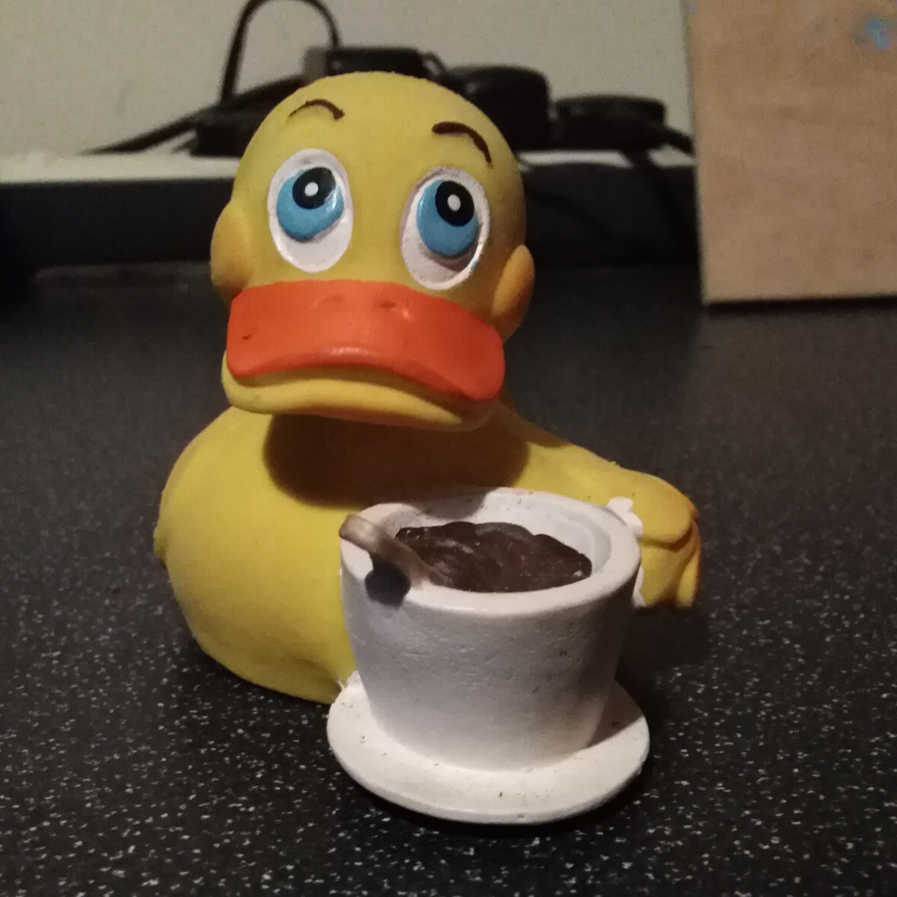
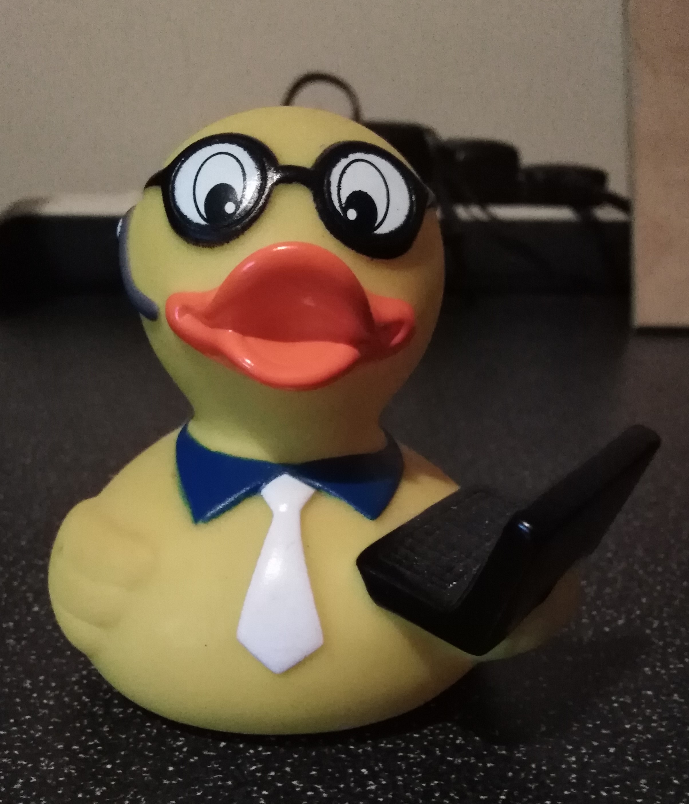
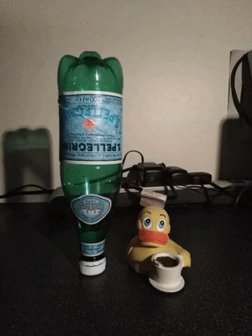

## The Avatar
#### Entry: , Published: 

| 
[Return to index](../)
| 

Earlier this week we were set a tiny task to create an animated avatar (gif) that would represent and have meaning to one’s self. My initial idea was to animate my three rubber ducks "swimming" around a cafetiere using stop motion animation. However, after taking several shoots it became apparent that it was a little inappropriate for an academic context. Since, the front runner (and my personal favourite) of the 3 ducks is known as "Stinky Finger" of which depicts a rubber duck sticking its middle finger up. The second is holding a cup of coffee [fig. 1] while the third is the tech support ducky [fig. 2]. (Sorry you'll have to Google [Rubber duck stinky finger](https://www.google.com/search?q=ruber+duck+stinky+finger) yourself). 

 
[Fig. 1. Coffee Rubber Duck]

 
[Fig. 2. Tech Support Rubber Duck]

The reason I originally choose this for my avatar is because it represents a typical working day in the life of myself (Ashley Sands). "Stink finger" represents how I pretty much feel when my alarm clock first goes off, the coffee duck is the second phase of my day, while the tech support ducky represents me getting to work as a programmer. Another influents to use rubber ducks for my avatar is because there a bit of programmers meme, due to a practise known as ``Rubber Duck Debugging`` (aka ``Rubber Ducking``) [[1](#c1), [2](#c2)]. The cafetiere on the other hand, well... I basically worship the cafetiere, every day starts with at least 2 cups of freshly pressed coffee (or espresso-based coffee). Anything less is considered a bad day, though its usually due over-sleeping rather than running out of coffee (I think coffee is the one thing I would panic buy if there were a shortage).  

So I had to change my idea to something a little more appropriate and to be honest, I was running a little dry on creativity at this point.

I simply, reduced the rubber ducks down to just the coffee duck and switch out the cafetiere for a San Pellegrino water bottle. The rubber duck represents my coffee and programming tendencies. While San Pellegrino is what I drink other than coffee (among other soda waters). The two objects simply just rotate around a central point. However, originally, once a full circle was completed I wanted the water bottle to topple over and smash the duck on the head. But just before the bottle hits the duck I wanted to switch out the screen for an image of Windows's famous **Blue Screen Of Death** (BSOD). Why? you may ask. Well, I’m a bit random like that and over the last 9 or 10 months my life has been plagued with various BSOD's to the point I had to get a new machine, since it appeared to be a motherboard issue. Though I decided to drop the BSOD idea since it was a little to jarring and didn’t quite work out how I would of liked (but that’s development for you). So I just ended up with the two rotating around a central point [fig. 3].

 
[Fig. 2. My Avatar]

Although I had created my avatar, I finished much later than I intended, not only because I had to come up with an alternative idea, but due to the fact iv be suffering from a major case of procrastination. Finishing up late also lead to going to bed much later which in turn caused me to over-sleep. I literally woke up 5 minutes after I was meant leave to go to university, which is about as bad as it gets at 8am when you have to fight the rush hour traffic. I got up, downed a coffee, grabbed my notepad and left to make the 20 odd mile journey, now running 20 minutes late. About halfway there I suddenly realised I had completely forgot to upload my avatar to my Google Drive or bring it a memory stick, since we were meant to present that to the rest of the cohort. By the time I had realised it far too late to go back and eventually arrived at university only 5 minutes late (I got really lucky with traffic on the day), totally disappointed with myself for forgetting to being my work.

Procrastination is something I need to get over quickly if I want to keep on top of my university work. It’s not something that I typically do, however, I think it’s just remnants of a long summer pretty much just playing video games and not doing all that much work. I feel  i just need to get stuck into project. Therefore, this has led me to read up on why we procrastinate and found a great TEDx talk by Nic Voge [[3](#c3)].

*"Procrastination isn’t shameful or a character flaw. Instead it’s rooted in a very human need: the need to feel competent and worthy"* - Nic Voge [[4](#c4)].

In Nic's talks about procrastination I relate to many things, such as scolding myself, wondering why I’m so lazy, disorganised and unmotivated. However, Nic claims that procrastination isn't shameful, but it’s actually pretty predictable when you understand the dynamics of motivation. Nic Voge believes it rooted in our self-worth, while some say it an inability to cope with difficult emotion and others consider it's connected to faulty time management. Also, according to Nic, it a form of self-protection, this way, if we get a bad result, it doesn’t mean we're not talented or able we were just too distracted to do our best, which I guess makes it easier to justify the poor result. 

*“Many people describe procrastination as being stuck at or against a wall or an obstacle they can’t get over”*  -  Nic Voge [[4](#c4)].

I know this is how I currently feel, stuck, worried I won’t get over this obstacle which, all-in-all, is causing unnecessary stress.

**So How does Nic suggest we can break the cycle?**

**We should be aware of what we're doing** and get familiar with out "greatest hits" of wasting time. We tend to have specific fall-back activities to play the delay game. Mines, mindlessly scrolling through Facebook, Reddit and YouTube (this is the real serious procrastination for myself), though sometimes I just see an interesting article online entirely unrelated to the task at hand and end up going down a supper deep rabbit hole (yeah, I learn something, but also I could just bookmark it and come back to it latter is it actually mattered to me).

**We need to "tip the balance"** from the negative "avoid" motives (reason why don’t want to do something) to the more positive "approach" motives (reasons we want to the thing). Apparently (and in my case) many procrastinators have a mistaken belief that there’s an underlining reason for putting off a task. However, Nic claims, "Often, that’s not the case. It’s simply that their fears dominate or overwhelm their ‘approach’ motives,". As an example, when I’m mind numbingly scrolling through Facebook instead of writing that essay that due in a few days, it could be due to the "avoid" motives - in particular, avoiding the project because you're terrified, you'll fail - which outweighs the "approach" motive. I know that at the present time this how I’m feeling, there will be too much written work [(this is scary being dyslexic)](./journal_0), it will be to fast paced and I’ll fall behind and it will all end up in failure. However, Nic suggests that rather than thinking of all the negatives, try and remind yourself why you want to do the activity. It could help to look at the bigger picture, your personal goals, objectives or mission. Then if it still seems intimidating, break it down into smaller more manageable tasks.

With all that said, I feel like I need to find a way to *"tip the balance"*. In our workshop today at university (after I didn’t present my avatar) we were put into pairs and set our second small project to remediate an existing piece of media (I won’t go into this now), and I’m full of self-doubt. I don’t know where start (well I do, open unity would be good :) ), nor how it’s all going to come together. All I really know right now is I must find a way to overcome this obstacle and I’m going to start by breaking the task at hand down into small more digestible tasks. In the coming days I’ll reveal the remediation project and how I (if at all) overcome my procrastination issue, along with anything else I could do to better utilize my time. We'll also have a brief look at how I approached the project and if there’s anything I could have done differently to improve our work.

 

### Cites
##### All citations are available in a single [bibtex file](../references.bib)

[1] K. Brouwers, Why Rubber Ducking is One of Your Greatest Resources as a Developer,” [Online]. Available: https://medium.com/@katiebrouwers/why-rubber-ducking-is-one-of-your-greatest-resources-as-a-developer-99ac0ee5b70a, [Accessed: 23 September 2021]. 

[2] B. Holland, Talk with a Duck,” [Online]. Available: https://rubberduckdebugging.com/cyberduck/, [Accessed: 23 September 2021]. 

[3] N. Voge,  “Self Worth Theory: The Key to Understanding & Overcoming Procrastination,”    [Online]. Available: https://www.youtube.com/watch?v=52lZmIafep4, [Accessed 23 September 2021].

[4] ——, “Tired of procrastinating? To overcome it, take thetime to understand it,” [Online].   Available: https://ideas.ted.com/tired-of-procrastinating-to-overcome-it-take-the-time-to-understand-it/, [Accessed: 23 September 2021]

 
 

| 
[Return to index](../)
| 

