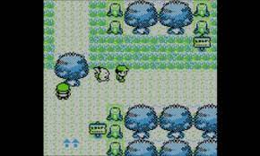
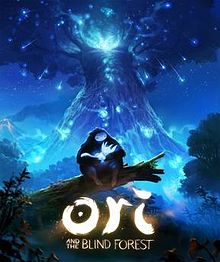
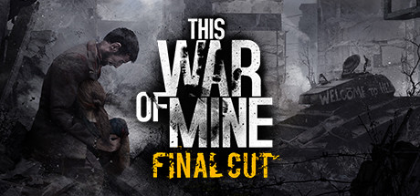
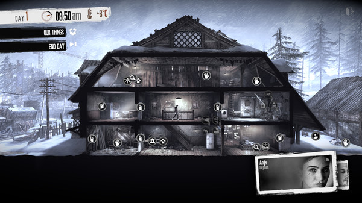

## Inducing Empathy In Games
#### Entry: , Published: 

| 
[Return to index](../)
| 

<!-- Points to write about.
- lack of leardership
- unorganised
- No GDD, lack of kamban board
- Lost sight of main goal.
  - narrative
  - protray emotion
- bringing it all together.
- WS - Not paying enought attenct to the Nural board.
  - and not doing the activatie assigned.
  - 

##
Title:  rapid ideation/prototype??
##

- This has made relise that i need to pay a bit more attachen
- Rapid Ideation and Prototypeing methods.

- Empathy....
  - Talk about the games in the paper and how we could of importerated aspect of them into our game.
  - and relate this to how we mabe missed the main gole pf the project.

-->
This week’s workshops is rapid ideation methods, which will become the basis for creating a prototype for a text driven game; which is themed around 'Call and Response'. Furthermore, there should be much consideration for the role of empathy and moral agency and while the game should be text-driven, it doesn’t limit us to text-based adventures. But rather opens the possibilities to visual novels through to open 2D/3D worlds and even includes paper protypes. It has been briefed that the player should be able to attain the resolution within 5 minutes of game play.  

For this project we were put into teams of three or four people and began discussing ideas. We decided to focus on mental health and decided to use a neutral and relatable character who is struggling to deal with several emotions. When a negative emotion is experienced, we enter the mind of our protagonist and play out the struggles, to only realise that everything will be ok in the end.

For the emotions we decided to focus on loneliness, frustration and boredom which are all set in different location, each with their own unique character that we feel represents the emotion. For loneliness we decided to use a scorpion lost in the desert trying to find their friends and family; for frustration we went for a salamander trying to find a calming sanctuary on the face of a volcano; and lastly for boredom, you play as a sloth who must climb the tallest tree to conquer their unhappiness. To illustrate our world, we decided to go for a 2D pixel art top-down adventure, like the old school Legend of Zelda and Pokémon games.

 
[fig. 1. Screenshot from Pokemon Yellow]
 
 

 
[fig. 2. Screenshot from The Legend of Zelda]

 

[Image-Pokimon][Fig. 1] [Image-Zelder][Fig. 2]

However, somewhere along the lines we lost (or forgot) the emotional dialogue aspect and overlooked how we were going to induce empathy on the player. In a later workshop at university each team was given a piece of writing to read and we were given 'Designing Game to Foster Empathy' [[1](#c1)] witch was really fitting since it something that we lost during the design process of our project. The paper has an incredibly insightful literature review of different forms of empathy taken from many areas of research. Furthermore, it gives several suggestions and principles for incorporating empathy into games and rounds off the paper by giving some example 'games for good'. So, let’s take a dive into the paper and have a look at how we could of better incorporated empathy into our game. 

The literature review begins with explaining that empathy is an important area of research, which has been investigated in a wind rage of fields from conflict resolution and psychology to health care training and even pre-school education. However, in social science it can be described as two broad categories of empathy [[2](#c2)]. The first 'cognitive empathy' which refers to intentionally taking another person' point of view. While on the other hand, 'emotional empathy' can be divided into two subcategories, parallel and reactive. Parallel empathy is understanding vicarious experience of another emotional state. While reactive is described as an emotional response that is dissimilar to what the other person is experiencing [[2](#c2)]. 

The paper then follows up with a wealth of information regarding these two board areas of research, however, it is a bit beyond the scope of this article. Therefore, we'll now begin to look at some of the suggestions and principals suggested in Belman and Flanagan’s article. Moreover, the authors also make a point that these are an evolving set of principles rather than a comprehensive set of guidelines.

##### Principle 1)
 *Players are more likely to empathise when an intentional effort is made when the game begins. This can be approached explicitly or via a more subtle encouragement focusing on an empathetic posture. However, if empathetic induction is ineffective from the offset, most players will play "unempathetically".* [[1](#c1)]

This principle makes me think of the opening scene of 'Ori and The Blind forest' [fig. 3] which induces empathy right from the offset, that is then conveyed throughout the story. It begins by giving the backstory of the joys and struggles of how we got to where we are now which then takes a dark turn of mourning and loneliness which comes across quite explicitly. There approach induces empathy really well, that it even brings a tear to the eyes of many players.

 
[fig. 3. Ori and the Blind Forest Logo and artwork]

With this in mind, I feel that we failed to convey the empathy onto the player. Rather than giving a backstory of 'how we got here', 'what are the struggles' and 'why we fell this way'; We just jumped straight in with 'hey, give me empathy because I’m lonely' without giving any dialogue or narrative to why we fell this way. We completely missed the point that the story was meant to be set during lockdown during the covid-19 pandemic and that’s why our main protagonist felt so lonely. If we had conveyed this message, it would of been relatable for many players and would of had a much greater chance of inducing empathy on the end-users.

##### Principle 2) *Give players specific recommendations about how their actions can address the issues represented in the game* [[1](c1)]

Belman and Flanagan further build on this principle by giving an example about assisting peers at risk of suicide in non-player characters (NPCs). They continue by suggesting that it is important that the behaviours are modelled accurately which could be a discouraging task to undertake. However, within student projects they often fallback on iconic representations rather than realistic behaviours, for example, a thunderstorm hover over the head of a suicidal NPCs head, which can be a useful representation in video games. However, it should be decided on a case-by-case basis whether an iconic or true-to-life representation is appropriate given the projects goals.

In my opinion 'This War of Mine' [[3](#c3)][fig. 4][fig, 5] is an fantastic example of a true-to-life representation of depression. In the game you play as a group of civilians, trying to survive in a besieged city; lacking essential items such as food and medicine; in danger of being shot by snipers or raided during the night by armed bandits and given constant moral dilemmas. Each of these aspects contributes to the mental state of the characters, as they become sad they begin to move slower, slouch over as they walk and voice their concerns through short dialogue. As the characters become depressed, they become almost unplayable, they refuse to participate in any activity and often remain in their beds for the entire day. It up to the player to instruct the remaining civilians to comfort, encourage and nurture them back to health. All of this can cause the player to feel a great deal of empathy and when things are going horrible wrong it can even cause a state of helplessness.

 
[fig. 4. This War of Mine, Logo and Artwork]
 
 

 
[fig. 5. This War of Mine, Civilian shalter]

 

While the amount of detail in 'This War of Mine' is well outside of the scope of our project there are certainly aspects that could have been incorporated. For example, we used still frames of our protagonist and a short amount of dialogue relating to the upcoming emotional state, if the player fails the activity its game over, they are simply to unhappy to continue. However, we could have included visual representation of the emotions that the player could interact with. For instance, our protagonist, a dog, starts in a basket and is to Lonny to leave. We should have included a chew toy that the player could interact with, though if the lonely mission were incomplete, it would give a short empathetic piece of dialogue to why they don’t want to play with the chew toy. This would also signal that the player must complete the current task before being able to continue the game and would further fix the issue of the game abruptly ending. Which on reflection is a terrible design choose, since if the player had depressed them self, they could interpret it as there’s no hope if you fail, which is certainly not the case. Furthermore, in the mini games, to depict the current emotional state of the character we simpler used a cop-out of a happiness bar. However, we could have used different sprites to represent a happy, neutral and unhappy state. Lastly it wouldn’t have been to difficult to adjusted the move speed of the character depending on the emotional state further emphasising the struggle of depression and building greater empathy on the player.

##### Principle 3) 
*A short burst of emotional empathy works well if desired outcomes to not require significant shifts in how players’ beliefs about themselves, the world, or themselves in relation to the world. But if these kinds of shifts are a design goal, the game should integrate both cognitive and emotional empathy* [[1](c1)]

Personally, I fell this is another thing that 'This War of Mine' does really well. Throughout the game several NPCs will arrive to your shelter and ask for help. Sometimes to go recuse someone while other times they could be asking for supplies to survive or seeking to join your shelter. They further play on this with their choose of character, for instance using children for some situations, which could bias the players decision depending on the circumstances. However, the players decision doesn’t overly affect the outcome of the game, it may change the mood of some characters depending on their belief system. Usually after such encounter, a short message will appear in the characters bio, sometimes they agree with the player while others will disagree. It often feels like the game is trying to challenge the player perception on the situation, when a character disagrees. This can sometimes leave the player feeling guilty for their original chooses.

We could have incorporated something similar, just without the level of depth in 'This War of Mine'. For instance, we could have implemented a collectable system. Let's say, in the forest scene you must collect hanging fruit, while climbing the tree. At some point during the ascend you meet an NPC who is also struggling and in desperate need food for their family. On encountering said NPC it could of started a short amount dialogue explaining their situation, which then give the player the option to either share some of the collected fruit or not. As the player is about to complete the minigame, they could meet another NPC with an opposing view to challenge the players perspective and maybe even leave the player feeling guilty for their decision. However, no matter of the player chooses the outcome of the minigame does not change.

##### Principle 4) 
*Emphasize points of similarity between the player and people or groups with whom they are supposed to empathize, but beware of provoking defensive avoidance.* [[1](c1)]

In 'This War of Mine' the similarities will come from the fact that most players are just civilians, however if the player was a former or current military personnel it may provoke a defensive avoidance response. However, in our game we choose to use an animal, such as a common pet that people often relate to and we choose to keep it free from gender in an attempt to further appeal to player. However, this approach could also cause to some players to avoid the emotional response intended. 

#### Conclusion  
In this post we have briefly explored some of the contributing factors of empathy. Furthermore, we have evaluated different principals to better incorporate empathy into games. During my interpretation of these principals, I have given some examples of some game that I feel have achieved the desired outcome. What’s more I have then explored how these mechanics could of been incorporated into my own project.

 

### Cites
##### All citations are available in a single [bibtex file](../references.bib)

[1] J. Belman and M. Flanagan, “Designing games to foster empathy,”InternationalJournal of Cognitive Technology, vol. 15, no. 1, p. 11, 2010.

[2] W. G. Stephan, K. Finlayet al., “The role of empathy in improving intergrouprelations,”Journal of Social issues, vol. 55, no. 4, pp. 729–743, 1999.

### Other Resources
**Ori and the blind forest**: https://www.orithegame.com/  [Last Accessed: 05 october 2021]  
**This war of mine**: https://www.thiswarofmine.com/  [Last Accessed: 05 october 2021]  

 
 

**Please refer to the [Sources](../references/Sources) file for content used from external sources along with usage and licence infomation**

 
 

| 
[Return to index](../)
| 

