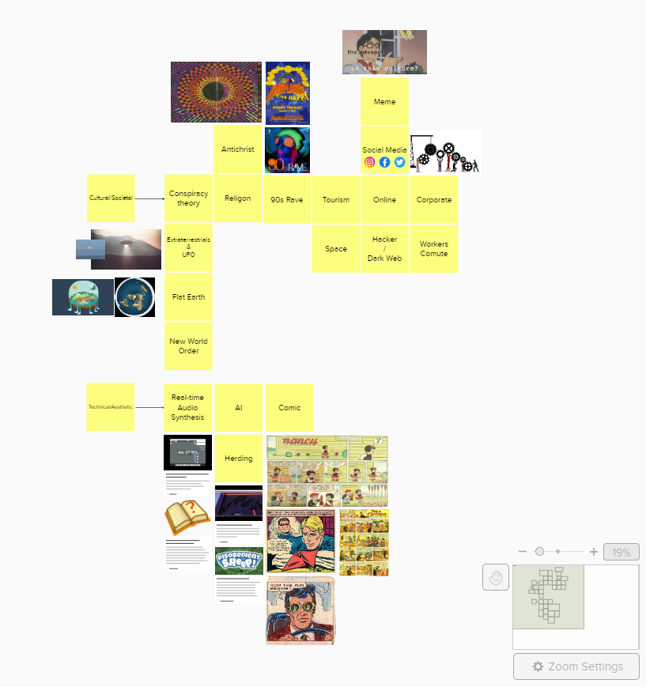
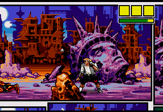
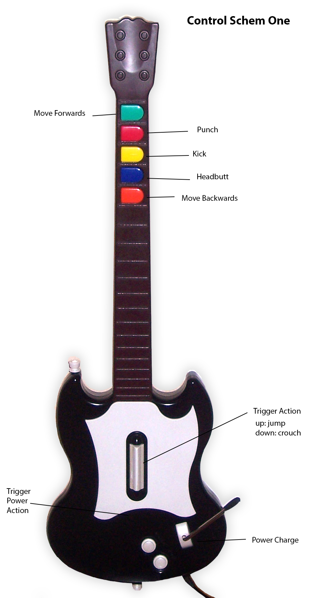
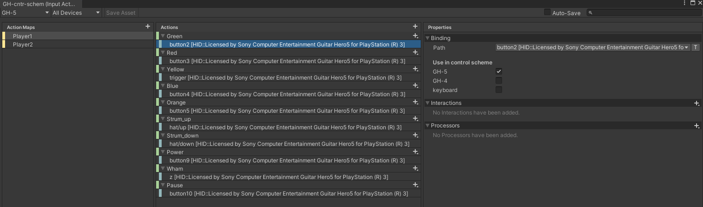
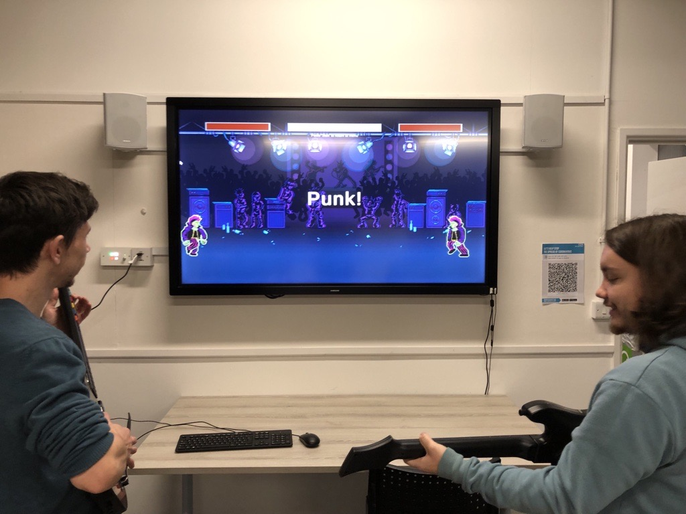
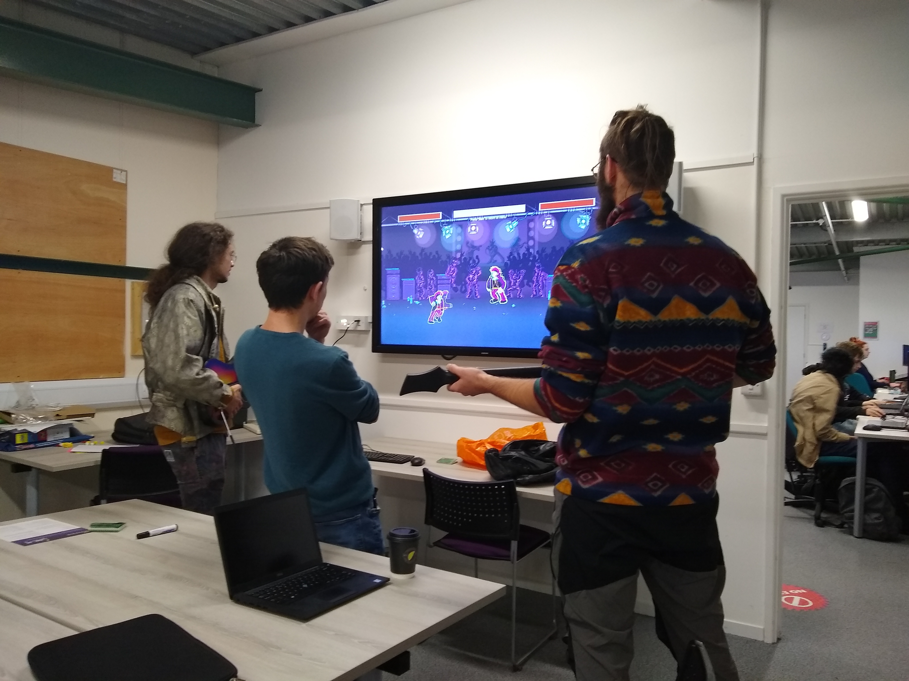

## A Technical look at A/B testing 2 controller schemes with Guitar Hero controllers
#### Entry: <span id="index"></span>, Published: <span id="published"></span>

<span class="priv_entry" style="display: inline;"></span>
| 
[Return to index](../)
| 
<span class="next_entry" style="display: inline;"></span>

We have been set another short project and were asked to begin thinking about ideas relating to culture and society. Furthermore, we also had to think of some technical aspects or aesthetics that we would like to work on. Later in a workshop we were asked to compile our ideas into a Mural board shared among the cohort, which we would then become a marketplace of ideas. We then had to choose some of the ideas we liked and form teams to begin producing a game artifact. My Mural board consisted of many ideas based around conspiracy theories, religion, 90s and corporation for the cultural aspect. While for the technical side of things it consisted of real-time audio synthesis, flocking (AI) and old school comic books as an aesthetic [fig. 1]. 

<p style="text-align: center;">

<br />
[fig 1. My Personal Mural board, the night befor the workshop]
</p>

Looking back, I may have missed the point a little, as most people just focused on developing a single idea around a cultural and technical/aesthetic aspect, however I had few random ideas. The first was to re-imagine how physics would work on a flat earth in a solar system based around our current understanding. You would then have to protect the flat earth form extra-terrestrials and UFOs. The second idea was to have an island with a road network and serval cities, the player would have to place work and events around island connected to roads witch the citizens would have to travel to. The player would have to strategically place the work and event locations around to prevent grid lock, which would become game over.

However, most other ideas in the cohort where much more developed than mine, therefor I joined another group. Which to be honest had quite a good idea in my opinion. It was to create a punk rock teamed street fighter game, which uses a guitar hero controller. Furthermore, each scene would be set in a comic strip (similar to [comix zone](https://sega.fandom.com/wiki/Comix_Zone) [fig. 2]) which is all illustrated using pixel art. During our initial sprinting planning session two different controller schemas where mentioned. The first schema [Fig. 3] aims to make you feel like you’re playing the guitar to fight while the second schema [Fig. 4] takes a more traditional approach to give instance feedback to the player.

<p style="text-align: center;">

<br />
[fig 2. Screenshot from the start of Comix Zone]
<br />
<br />

<br />
[Fig.3 controller schema 1]
<br />
<br />

<br />
[Fig.4 controller schema 2]
</p>

Basically, in the first schema you hold down an attack button and strum to active the attack, strum up to jump, strum down to crouch and use two of the buttons to move. While on the second schema you just press the attack buttons to activate the attack, strum up and down to move and use the remaining two buttons to jump and crouch. As a team we couldn’t come to an agreement on which schema to use, though we were leaning towards the more traditional approach. However, we decided to do some A/B testing to see weather players preferred one over the other. This meant i now how to find a way to implement two different controller schemas without have two different code bases.

### Implementing the Controller Schema

To begin I configure the two controllers in the new Unity inputs system [[1](#c1)] as it allows different action maps (or controller groups). In this case configured it as ``player_1`` and ``player_2`` [fig. 5] each mapped to its own Guitar Hero controller, in this case this was quite simple since both controllers are from different versions of the game making it easy to distinguish between the two. Once I had defined the inputs for the two controllers, I had to find a way to access the two action maps consistently without having too much duplicate code. So, I decided to implement each input as a property which selects the correct action map based on the player number [Listings. 1].

<p style="text-align: center;">

<br />
[Fig 5. Unity inputs action maps For 'Are You Punk Enough?'.]
</p>

```c#

public enum Player{ One=-1, Two=1 }			// define as -1 and 1 since its the player multiplier for direction and power attack
public Player playerNumber = Player.One;

// Inputs
protected float Green  => (playerNumber == Player.One ? inputSchem.Player1.Green  : inputSchem.Player2.Green ).ReadValue<float>();
protected float Red    => (playerNumber == Player.One ? inputSchem.Player1.Red    : inputSchem.Player2.Red   ).ReadValue<float>();
protected float Yellow => (playerNumber == Player.One ? inputSchem.Player1.Yellow : inputSchem.Player2.Yellow).ReadValue<float>();
protected float Blue   => (playerNumber == Player.One ? inputSchem.Player1.Blue   : inputSchem.Player2.Blue  ).ReadValue<float>();
protected float Orange => (playerNumber == Player.One ? inputSchem.Player1.Orange : inputSchem.Player2.Orange).ReadValue<float>();

protected float Strum_up   => (playerNumber == Player.One ? inputSchem.Player1.Strum_up   : inputSchem.Player2.Strum_up  ).ReadValue<float>();
protected float Strum_down => (playerNumber == Player.One ? inputSchem.Player1.Strum_down : inputSchem.Player2.Strum_down).ReadValue<float>();

protected float Wham => (playerNumber == Player.One ? inputSchem.Player1.Wham : inputSchem.Player2.Wham).ReadValue<float>();

```
[Listings. 1, Inputs properties which selects the correct action map]

Following this I decided to just implement the more traditional schema (schema 2) as it is a little simpler and would allow me to develop the basic structure and functionality for each action. Therefor I implemented each action so it has an entry, hold and exit state [Listing. 2].

```c#

private void Punch()
{

	if (Red > 0 && !redDown && CurrentAction == Actions.None)   // entry
	{
		CurrentAction = Actions.Punch;
		animator.SetTrigger("Punch");
		redDown = true;
	}
	else if ( CurrentAction == Actions.Punch )                  // hold
	{
		// do hit box stuff :)
	}
	else if ( Red == 0 && redDown )                             // exit
	{
		redDown = false;
	}

}

```
[Listings. 2, Punch method with the entry, hold and exit states]

Each action (Jump, Crouch, Punch, Kick, Headbutt) is almost the same as punch [Listings. 2] except they set the relevant animations and button presses. Now I had to find a way to implement the other controller scheme without duplicating the code. So I went about making the ``Player`` class abstract, so I could extend the functionality. Originally, I decided to add virtual methods for each state so I could also check if the player strummed while pressing the action key [Listing. 3].

```c#

private void Punch()
{
	// Red
	// Play Punch Animation
	if (Red > 0 && !redDown && CurrentAction == Actions.None)
	{
		
		redDown = true;
		PrePunch();
		
	}
	else if ( CurrentAction == Actions.Punch )
	{
		RunPunch();
	}
	else if ( Red == 0 && redDown )
	{
		redDown = false;
		damageApplied = false;
		PostPunch();
	}

}

protected virtual void PrePunch() 
{
	CurrentAction = Actions.Punch;
	animator.SetTrigger("Punch");
	SendDamage(punchDamage);
}

protected virtual void RunPunch() 
{
	SendDamage(punchDamage);
}

protected virtual void PostPunch() {}

```
[Listings. 3 added virtual method for each action state.]

However, I soon realised this was more complicated than it needed to be, and there was no intention of extending the functionality of the action except for checking if strum is up/down. Therefor I racked my brain a bit more to find a more logical solution, I thought it might be better to replace the if statement condition with abstract methods (for enter and exit) [Listings. 4] so that they can be implemented in a child class.

```c#
private void Punch()
{
	// Red
	// Play Punch Animation
	if ( EnterPunch() )
	{
		
		redDown = true;
		CurrentAction = Actions.Punch;
		animator.SetTrigger("Punch");
		SendDamage(punchDamage);

	}
	else if ( CurrentAction == Actions.Punch )
	{
		SendDamage(punchDamage);
	}
	else if ( ExitPunch() )
	{
		redDown = false;
		damageApplied = false;
	}

}

protected abstract bool EnterPunch();

protected abstract bool ExitPunch();
```
[Listings. 4, added abstract method for enter and exist conditions]

this now meant I could simple inherit form the ``Player`` class and just implement the Enter and Exit conditions for each controller schema [listings. 5][listings. 6]

```c#
protected override bool EnterPunch()
{

	bool struming = Strum_up > 0 || Strum_down > 0;

	return struming && Red > 0 && !redDown && CurrentAction == Actions.None;
}

protected override bool ExitPunch()
{
	return Strum_up == 0 && Strum_down == 0;
}
```
[Listings. 5, Player Controle schema 1, enter exit methods for punch]

```c#
protected override bool EnterPunch()
{
	return Red > 0 && !redDown && CurrentAction == Actions.None;
}

protected override bool ExitPunch()
{
	return Red == 0 && redDown;
}
```
[Listings. 6, Player controller schema 2, enter exit methods for punch]

Now all I had to do was created a ``BasePlayer`` prefab and attach the relevant player controller schema to a prefab variant of the ``BasePlayer`` and furthermore, add them to their own scene. Then we ready to build the project and A/B test.

### A/B Testing
To begin the A/B testing [[2](#c2)][[3](#c3)], we asked several people (about 10 in total) to play through the two controller schemas. We got quite a mixed bag or response which wasn’t necessarily what we expected. We expected that most people would prefer the traditional schema (schema 2), however what we found was the more "casual" players preferred the traditional schema while the more "hardcore" players liked the potential of the guitar scheme (schema 1). In general, everyone seemed to really liked how responsive the traditional schema was, in the sense that you press a button and it attacks, however the people that liked the guitar scheme found it was very satisfying to strum to trigger the attack. They also felt there was more to build on using the guitar scheme for example, strumming down could trigger an over arm punch while strumming up would perform an under-arm punch (or upper cut). However, players did find some potential issues with the guitar scheme, because jump is mapped to strum up without pressing an action button it made it extremely hard to preform jump, attack combos, which is an important aspect of games such as street fighter. What’s more, we found that people with smaller hands found it hard to move forwards and backwards in the guitar scheme or to jump and crouch in the traditional schema because they were mapped to the top and bottom buttons respectively. We did want to make switching between the two actions to be hard, however it wasn’t received well by the players, so we had a meeting to discuss solutions for the points raised.

<p style="text-align: center;">

<br />
[Fig 6. Ashley (me) [left] and Matt [right]  play testing 'Are you Punk Enough?']


<br />
[Fig 7. Ashley (me) [center] observing an A/B testing session for 'Are you Punk Enough?']

</p>

To start because the responses where so mixed, we decided that we should have two game modes, "casual" (traditional schema) and "punk" (guitar scheme). We then discussed how we could resolve the minor issues raised and came up with quite an easy solution for the move (guitar scheme) and jump/crouch (traditional schema) buttons. We decided to just move them to the top two buttons and have the attack actions as the bottom 3 buttons. Furthermore, to resolve the jump combo issue we think it would be worth moving it to the whammy bar on the controller and we would do further A/B testing in the future. 

### Conclusion
At first I found it quite daunting having to find a way to create two different controller schemas, but after coming up with a relatively simple solution it was pretty straight forwards to implement. Furthermore, I’ve never really done any form of A/B testing, however, I now see that it is one of the most valuable things a developer can do to get player insight into two different systems. What’s more, we didn’t expect that the guitar scheme would be as well received as it was due to its potential, although it needs a little more refining. I will decently do more A/B testing in the future as it’s been a very pleasant experience to gain insights.

<p style="text-align: center;">
<iframe src="https://drive.google.com/file/d/1k7QrnfXpKwgTdLJ18n8dkoEvP1UPG0eA/preview" width="640" height="480" allow="autoplay"></iframe>
[Fig 7. 'Are You Punk Enough?' Game play vedio]
</p>

<!-- 
Notes:
- need to add figs of play testing.
- and maybe a vedio of gameplay!
-->

### Cites
##### All citations are available in a single [bibtex file](../references.bib)

<p id="c1">
[1] R. Damm, “Introducing the new Input System,” [Online]. Available: https://vwo.com/ab-testing/, [Accessed: 20 October 2021] 
</p>

<p id="c2">
[2] VWO, “A/B Testing Guide,” [Online]. Available: https://blog.unity.com/technology/introducing-the-new-input-system, [Accessed: 20 October 2021] 
</p>

<p id="c3">
[3] S. Collins, “A/B Testing for Game Design Iteration: A Bayesian Approach,” [Online Vedio]. Available: https://www.gdcvault.com/play/1020201/A-B-Testing-for-Game, [Accessed: 20 October 2021] 
</p>

### Other Resources
**Comix Zone**: https://sega.fandom.com/wiki/Comix_Zone  [Last Accessed: 05 october 2021]  

<br />
<br />

<span class="priv_entry" style="display: inline;"></span>
| 
[Return to index](../)
| 
<span class="next_entry" style="display: inline;"></span>

<br />
<br />

**Please refer to the [Licences and Sources](../resources/licences-and-sources) document for content used from external sources along with usage and licence infomation**

<br />

<script>
// Store the entry id and published values in a JS script, to make life easier with updateing links.
entry_id  = 6
published = "18-10-2021" 
week = 5

document.getElementById("index").innerHTML = entry_id
document.getElementById("published").innerHTML   = `${published} (Week: ${week})`


next_page = "journal_"+ (entry_id + 1)
priv_page = "journal_"+ (entry_id - 1)

next_links = document.getElementsByClassName("next_entry")
priv_links = document.getElementsByClassName("priv_entry")

// atempt to fetch the next page. 
// if we get an ok responce display the next links, 
// otherwise we have most likely reaced the end.
fetch('./'+next_page+'.html')
    .then (
        responce => {
        if ( responce.ok ) 
            for ( let i in next_links )
                next_links[i].innerHTML = '<a href="./'+next_page+'">Next ></a>'
        }
    )

// only display the priv page link if we have gone past the first page.
// theres no need to fetch the prv page, since we know the min id is 0
if (entry_id > 0)
    for ( let i in priv_links )
        priv_links[i].innerHTML = '<a href="./'+priv_page+'">< Priv</a>'


</script>